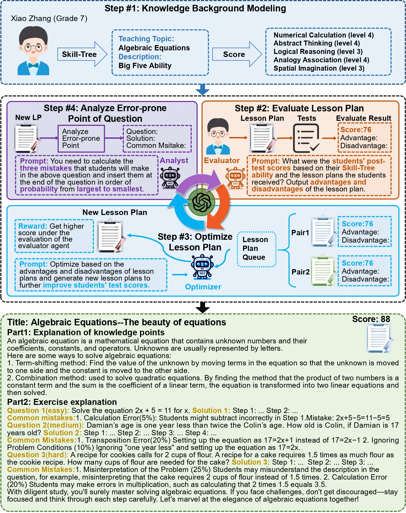
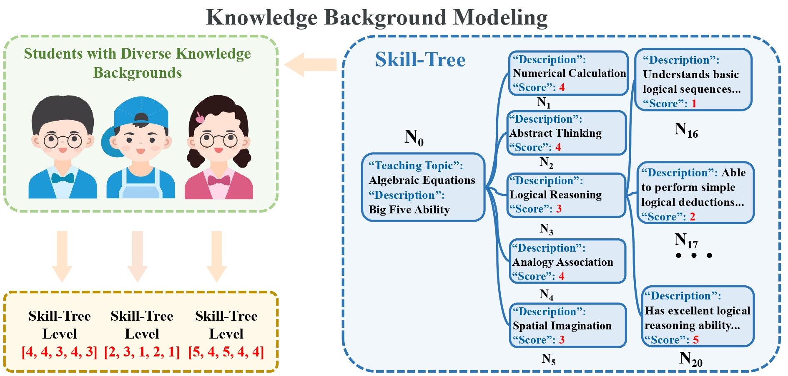
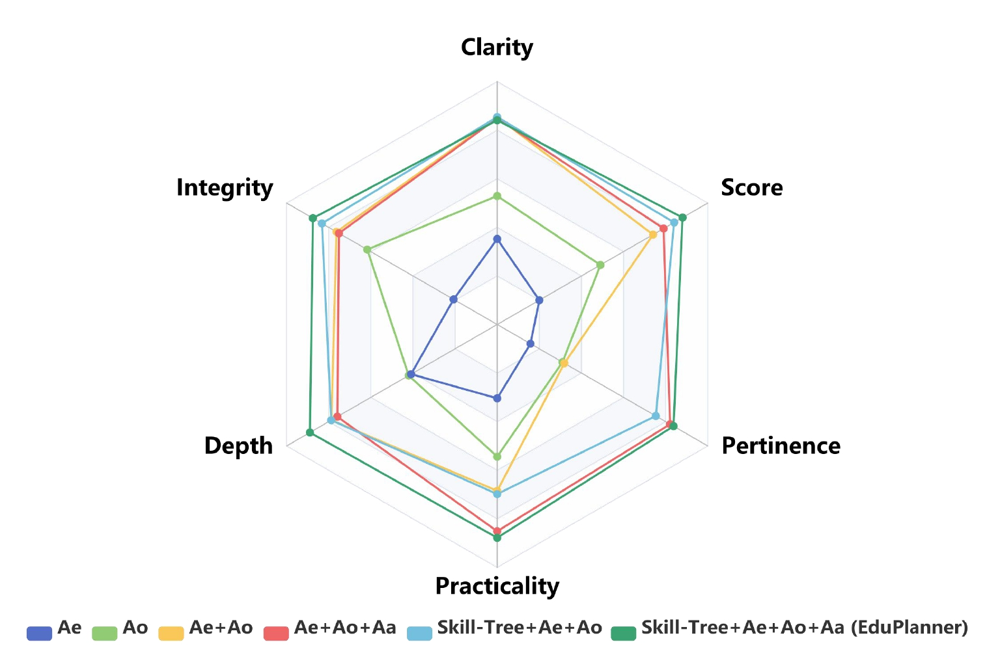

# EduPlanner: A Multi-Agent System for Customized and Intelligent Lesson Planning

## 🛠️ Framework
Large Language Models (LLMs) have significantly advanced smart education but still face challenges in evaluating and optimizing lesson plans. To address these issues, we developed **EduPlanner**, a multi-agent system that includes an **Evaluator Agent**, an **Optimizer Agent**, and a **Question Analyst**. These agents collaborate adversarially to generate customized and intelligent lesson plans.

## 🌳 Skill-Tree Structure
EduPlanner employs a novel **Skill-Tree** structure to accurately model the background knowledge of student groups. This structure personalizes lesson plans based on students’ knowledge levels and learning abilities, ensuring each lesson is tailored to individual needs.

## 📊 CIDDP Evaluation
We introduce **CIDDP**, an LLM-based five-dimensional evaluation module encompassing **Clarity**, **Integrity**, **Depth**, **Practicality**, and **Pertinence**. This evaluation system comprehensively assesses the quality of lesson plans and facilitates their optimization.

## 🧪 Results
Experiments conducted on the **GSM8K** and **Algebra** datasets demonstrate that EduPlanner excels in evaluating and optimizing lesson plans, significantly improving the efficiency and effectiveness of instructional content. 

## 🔬 Conclusion
Experience the future of education with **EduPlanner**, where intelligent lesson planning meets personalized learning! 🚀

*For more details, please refer to our paper (EduPlanner: LLM-Based Multi-Agent Systems for Customized and
 Intelligent Instructional Design).*
